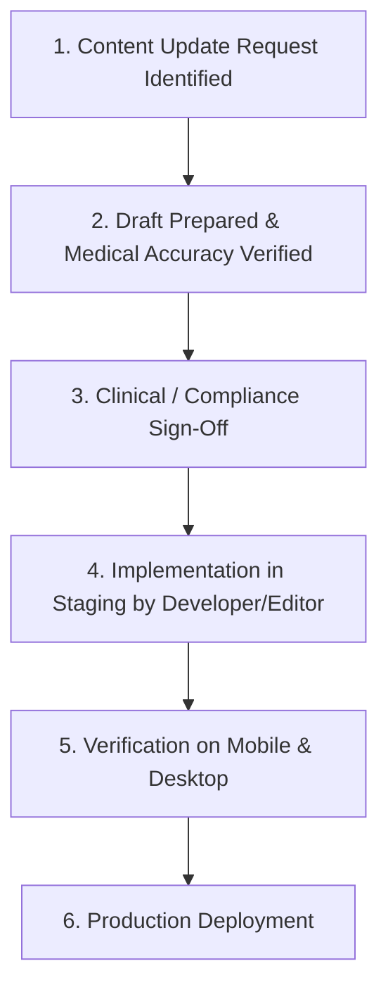

# Healix Healthcare Platform — Client & Content Owner Handbook

## 1. Executive Website Overview
Healix is a human-centered digital healthcare platform designed to communicate preventative medicine, executive wellness, and proactive longevity care with high clinical credibility.

---

## 2. Key Pages & Website Structure

| Page | URL Path | Primary Purpose |
| :--- | :--- | :--- |
| **Home** | `/` | Brand introduction, primary value proposition, key specializations, clinical leadership, membership preview, patient trust signals, FAQs, consultation CTA. |
| **About** | `/about` | Clinical story, founding mission, healthcare philosophy, leadership team, core values, facility standards. |
| **Services Overview** | `/services` | Filterable catalog of clinical specializations, diagnostic modalities, and wellness protocols. |
| **Service Details** | `/services/:slug` | In-depth breakdown of specific clinical programs (inclusions, diagnostics, duration, physician advisory). |
| **Medical Faculty** | `/professionals` | Roster of board-certified clinicians, leadership biographies, and specialty credentials. |
| **Physician Profile**| `/professionals/:slug` | Dedicated doctor profile with clinical background, areas of focus, and consultation request link. |
| **Care Plans** | `/plans` | Transparent membership pricing tiers, monthly/annual toggle (15% discount), comparison matrix. |
| **Patient Outcomes** | `/portfolio` | Transformation case studies, measurable biomarker improvements, and clinical outcomes. |
| **Case Study Detail**| `/portfolio/:slug` | In-depth case narrative detailing patient baseline, clinical interventions, and long-term results. |
| **Health Resources** | `/resources` | Evidence-based longevity articles, healthspan guides, and newsletter subscription. |
| **Article Reading** | `/resources/:slug` | Focused medical article reading view with citations, author credentials, and related reads. |
| **FAQ Hub** | `/faq` | Categorized interactive accordions addressing admissions, diagnostic tests, billing, and memberships. |
| **Contact & Intake** | `/contact` | Confidential consultation intake form, physical center locations (Boston/NY), direct phone lines. |
| **Legal & Policies** | `/legal/:policy` | Privacy Policy, Terms of Service, Medical & HIPAA Information Disclaimers. |

---

## 3. Content Ownership & Responsibility Model

- **Clinical Content Owner**: Responsible for reviewing medical program descriptions, diagnostic panel inclusions, and healthspan articles for medical accuracy.
- **Practice Operations Manager**: Responsible for maintaining clinic hours, phone numbers, physician availability, and fee schedules.
- **Marketing & Brand Manager**: Responsible for reviewing hero messaging, value proposition copy, and public case studies.
- **Technical Administrator**: Responsible for DNS records, domain renewals, hosting billing, and escalation of technical inquiries.

---

## 4. Content Update Workflow

### What You Can Change Safely
- Text descriptions, FAQ answers, pricing values, and clinician biographies in `client/src/data/`.
- Medical articles and healthspan guides in `client/src/data/articles.js`.
- Clinic operating hours, physical addresses, and contact email addresses in `client/src/data/`.

### What Requires Developer Support
- Adding new navigation menu links or modifying routing URLs.
- Changing color tokens, typography scales, or layout component structures.
- Altering intake form validation schemas, security headers, or API rate limiters.

---

## 5. Support & Emergency Escalation
- **Standard Inquiries**: Submit updates or minor requests with 3 business days lead time.
- **Urgent / Outage Escalation**: Contact On-Call Engineering Lead immediately via phone / emergency dispatch channel.
