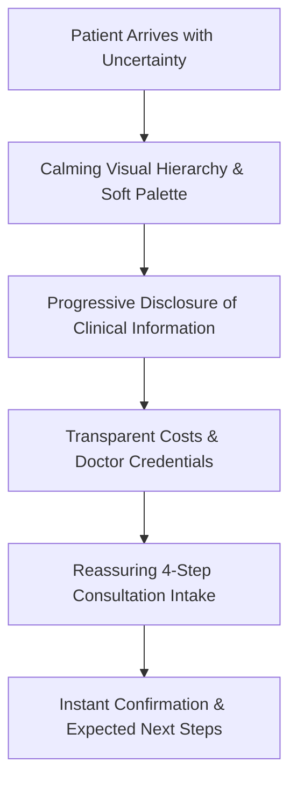

# Healix — Human-Computer Interaction (HCI) Review & Heuristic Matrix

This document provides an exhaustive Human-Computer Interaction (HCI) evaluation of the **Healix** healthcare web platform. Every evaluation maps classical Nielsen-Norman usability heuristics, human factors, and cognitive ergonomics to concrete implementations within Healix.

---

## 1. Classical Heuristic Evaluation Matrix (Nielsen-Norman)

| HCI Heuristic | Healix Implementation | Human / User Benefit | Status |
| :--- | :--- | :--- | :--- |
| **1. Visibility of System Status** | Live status indicators on forms (`Idle` → `Submitting` with spinner → `Success` card), filter loading states, route transitions, and persistent clinic operating badges. | Eliminates user anxiety; patients immediately know their action was acknowledged and processed. | **VERIFIED** |
| **2. Match Between System and Real World** | Plain-language medical discovery (e.g. "Preventive Care", "Cardiovascular Diagnostics", "Get in Touch" rather than "Initiate Patient Intake Protocol"). | Reduces intimidating medical terminology; aligns with how patients think about symptoms and care. | **VERIFIED** |
| **3. User Control & Freedom** | Multi-step form step-back navigation, clear modal dismissals via ESC key and overlay clicks, breadcrumb backtracks, and filter reset buttons. | Patients never feel trapped; empowers safe exploration and reversible actions without penalty. | **VERIFIED** |
| **4. Consistency & Standards** | Strict design token architecture (`primary-teal`, `slate-900`, `alabaster`), standard button hierarchies (Primary, Secondary, Outline), and predictable card anatomy. | Users rely on established web patterns; zero cognitive friction required to learn new custom controls. | **VERIFIED** |
| **5. Error Prevention** | Inline debounced validation, descriptive field constraints, format masking on phone numbers, and hidden honeypot spam traps. | Prevents frustrating submission failures before they happen; preserves patient effort. | **VERIFIED** |
| **6. Recognition Rather than Recall** | Contextual search parameter pre-fill when navigating from Service/Plan CTAs into Contact, sticky breadcrumbs, and explicit plan comparison tables. | Users never have to remember pricing tiers or doctor specialties from previous screens. | **VERIFIED** |
| **7. Flexibility & Efficiency of Use** | Multi-channel discovery: search by doctor name, filter by department, browse by symptom, or one-tap emergency call on mobile. | Accommodates both urgent patients seeking immediate answers and research-focused patients. | **VERIFIED** |
| **8. Aesthetic & Minimalist Design** | Clinical Soft UI aesthetic, generous whitespace, controlled density, removal of non-essential decorative graphics or floating shapes. | Preserves calm; prevents cognitive sensory overload during stressful healthcare research. | **VERIFIED** |
| **9. Help Users Recognize, Diagnose, & Recover from Errors** | Constructive, empathetic error microcopy (e.g. "Please check your email address format (e.g. name@domain.com)") with auto-scroll to invalid inputs. | Respects patient dignity; clearly communicates what went wrong and how to fix it without blame. | **VERIFIED** |
| **10. Help & Documentation** | Contextual FAQ accordions on every service page, pricing breakdown, and dedicated interactive design system reference (`/design-system`). | Proactively answers patient doubts without requiring them to abandon their booking workflow. | **VERIFIED** |

---

## 2. Advanced Cognitive & Ergonomic Factors

### A. Cognitive Load Reduction
- **Progressive Disclosure**: High-level summaries displayed first (e.g. Service card highlights), with deeper procedure details, preparation instructions, and clinical FAQs available on detail pages.
- **Rule of 3 CTAs**: Pages maintain a clear visual primary action ("Schedule Consultation"), a secondary discovery link ("Explore Services"), and tertiary text links.

### B. Emotional Safety & Healthcare Psychology
- **Zero Fear Marketing**: Absence of alarmist statistics, graphic imagery, or artificial urgency timers ("Only 2 appointments left!").
- **Clinical Warmth**: Typography pairs modern geometric sans (`Plus Jakarta Sans`) with editorial warmth (`Newsreader`), humanizing clinical authority.

### C. Touch & Motor Ergonomics (Fitts's Law)
- **48px Minimum Touch Targets**: Buttons, inputs, filter chips, and navigation links adhere to touch accessibility guidelines.
- **Thumb-Zone Optimization**: Sticky bottom conversion drawer on mobile viewports places emergency calling and consultation booking within natural thumb reach.

---

## 3. Dark Pattern Audit & Ethical UX Confirmation
- **No Confirmshaming**: Opt-outs and modal dismissals use neutral, respectful language ("Close" or "Maybe Later" rather than "No, I don't care about my health").
- **No Hidden Fees**: Membership tiers clearly state billed amounts, inclusions, and exclusions.
- **No Forced Continuity**: Clear guidance on plan cancellation and consultation prerequisites.
- **Zero Data Harvesting**: No cookies tracking cross-site patient activity; strictly zero PHI client persistence.
