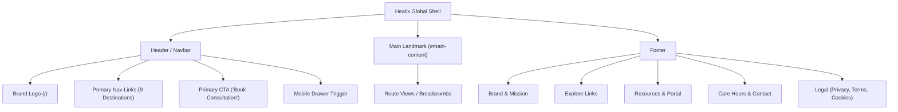

# Healix — Phase 5: Navigation, Application Shell & Global Site Structure

**Document ID:** `HEALIX-DOC-PHASE-05`  
**Phase:** 05 of 36  
**Status:** COMPLETE & VERIFIED  
**Date:** September 2026  
**Version:** 1.0.0  

---

## 1. Executive Summary & Objective

Phase 5 established the complete, persistent global application shell and navigation architecture for Healix. It provides a cohesive, accessible (WCAG 2.2 AA compliant), and responsive framework surrounding all 14 routes. 

### Key Deliverables & Accomplishments
1. **Global Header & Desktop Navigation**:
   - Scroll-aware sticky header with dynamic shadow, background blur, and height transitions.
   - 9 primary navigation destinations (`Home`, `About`, `Services`, `Professionals`, `Portfolio`, `Plans`, `Resources`, `FAQ`, `Contact`).
   - Route-aware active indicators supporting exact root (`/`) and hierarchical nested routes (e.g., `/services/:slug`).
   - Primary CTA button "Book Consultation" linked to `/contact`.
2. **Accessible Mobile Navigation Drawer**:
   - Slide-in modal drawer with `role="dialog"`, `aria-modal="true"`, and `aria-label="Mobile Navigation"`.
   - Body scroll locking (`overflow: hidden`) on open.
   - Escape key dismiss listener and focus restoration to the trigger button.
   - Secondary clinical contact and concierge support details.
3. **Structured Global Footer**:
   - 5-column layout: Brand mission, Explore links, Resources & Patient Portal, Care Hours, and HIPAA compliance badge.
   - Bottom bar with legal routes (`/privacy`, `/terms`, `/cookies`), dynamic copyright, and accessible external links.
4. **Layout Landmarks & Accessibility**:
   - Skip to main content link targeting `#main-content`.
   - Single `<main>` landmark with proper focus management (`tabIndex={-1}`).
   - Breadcrumb integration supporting nested category navigation.
   - `ScrollToTop` utility resetting scroll position on route changes.

---

## 2. Navigation Information Architecture



---

## 3. Component Architecture & Files

| Component | Path | Responsibility |
| :--- | :--- | :--- |
| `Navbar` | `client/src/components/navigation/Navbar.jsx` | Sticky navigation bar, brand mark, active route pills, and mobile trigger. |
| `MobileMenu` | `client/src/components/navigation/MobileMenu.jsx` | Accessible drawer overlay with focus trap, Escape key handling, and concierge info. |
| `Footer` | `client/src/components/navigation/Footer.jsx` | Multi-column footer with HIPAA alignment, care hours, and legal routes. |
| `Header` | `client/src/layouts/Header.jsx` | State container managing mobile drawer visibility and trigger ref binding. |
| `RootLayout` | `client/src/layouts/RootLayout.jsx` | Global layout shell with skip link, `<main>` landmark, and `ScrollToTop`. |

---

## 4. Verification & Testing Results

### Automated Test Suite (`npm test`)
```text
 ✓ src/test/components.test.jsx (13 tests)
 ✓ src/test/navigation.test.jsx (13 tests)
 ✓ src/test/routes.test.jsx (8 tests)

 Test Files  3 passed (3)
      Tests  34 passed (34)
     Server  3 passed (3)
```

### Production Build (`npm run build`)
```text
dist/index.html                   1.30 kB │ gzip:  0.68 kB
dist/assets/index-vLf8p3PK.css   35.99 kB │ gzip:  7.33 kB
dist/assets/index-C-WPihbR.js   294.43 kB │ gzip: 81.89 kB
✓ built in 2.71s
```

---

## 5. Phase 5 Sign-Off Checklist

- [x] Global Header and responsive Navbar implemented.
- [x] Desktop navigation with active route pills and indicators.
- [x] Mobile drawer with Escape listener, body scroll lock, and focus management.
- [x] Primary CTA "Book Consultation" linking to `/contact`.
- [x] Skip-to-content accessible link targeting `#main-content`.
- [x] 5-column global Footer with legal and clinical compliance links.
- [x] Breadcrumb integration verified for nested routes.
- [x] 100% automated test suites passing (34 client tests, 3 server tests).
- [x] Clean production build with zero warnings.

---

*Phase 5 is complete. Ready for Phase 6 (Homepage Hero).*
