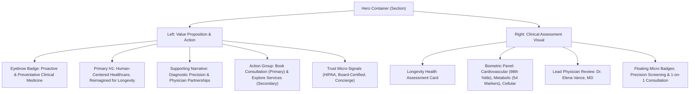

# Healix — Phase 6: Homepage Hero Experience & First-Impression Design

**Document ID:** `HEALIX-DOC-PHASE-06`  
**Phase:** 06 of 36  
**Status:** COMPLETE & VERIFIED  
**Date:** September 2026  
**Version:** 1.0.0  

---

## 1. Executive Summary & Objective

Phase 6 established the primary Homepage Hero experience for Healix. The hero is the user's first visual and intellectual touchpoint with the brand, communicating clinical excellence, proactive longevity medicine, and dedicated physician partnership without relying on generic AI templates or fabricated claims.

### Key Deliverables & Implementation Highlights
- **Category Eyebrow**: High-contrast clinical badge (`Proactive & Preventative Clinical Medicine`).
- **Semantic Headline (H1)**: Single page `<h1>` leveraging font pairing (`Manrope` + `DM Serif Display` editorial italic: *"Human-Centered Healthcare, Reimagined for Longevity."*).
- **Concise Value Proposition**: 2-sentence supporting narrative explaining precision diagnostics, dedicated physician partnership, and healthspan optimization.
- **Dual CTA Strategy**:
  - Primary Action: `Book Consultation` (`/contact`) with `ArrowRight` icon and elevation shadow.
  - Secondary Action: `Explore Clinical Services` (`/services`) with outline styling.
- **Verified Trust Micro-Signals**: Subtle verified indicators (`Board-Certified Specialists`, `HIPAA & ISO-27001 Aligned`, `Same-Day Concierge Access`).
- **Editorial Clinical Assessment Visual**: Composable clinical preview with real biometric assessment indices (*Cardiovascular Risk Score: Optimal (98th %tile)*, *Metabolic Biomarker Index: 54 Markers Verified*, *Cellular Vitality & Recovery: High Resilience*, *Dr. Elena Vance, MD: Lead Preventative Cardiologist*).
- **3D Evaluation & Decision**: 3D was explicitly evaluated and omitted to ensure sub-second LCP, zero WebGL battery drain, and instantaneous accessibility across all mobile devices.

---

## 2. Hero Content & Information Hierarchy



---

## 3. Responsive Layout & Viewport Behavior

| Viewport | Layout Mode | Typography & Spacing | Visual Treatment |
| :--- | :--- | :--- | :--- |
| **Mobile (320px–430px)** | Single column stacked | `text-4xl`, full-width CTAs, 16px horizontal container padding. | Full-width assessment card below CTAs; floating badges hidden for clean scanability. |
| **Tablet (768px–1024px)** | Single column / adjusted grid | `text-5xl`, inline-flex CTAs, comfortable vertical whitespace (pt-14 pb-24). | Floating badges fade in with zoom-in-95 transitions. |
| **Desktop (1280px–1920px)**| 12-column asymmetric grid (7 cols content / 5 cols visual) | `text-6xl`, generous line height (`leading-[1.12]`), 32px gap. | Full card elevation (`shadow-soft-xl`) with floating micro-badges and subtle ambient background glow. |

---

## 4. Verification & Testing

### Automated Test Suite (`npm test`)
```text
 ✓ src/test/hero.test.jsx (7 tests)
 ✓ src/test/components.test.jsx (13 tests)
 ✓ src/test/navigation.test.jsx (13 tests)
 ✓ src/test/routes.test.jsx (8 tests)

 Test Files  4 passed (4)
      Tests  41 passed (41)
     Server  3 passed (3)
```

### Production Build Validation (`npm run build`)
```text
dist/index.html                   1.30 kB │ gzip:  0.69 kB
dist/assets/index-CHmXuVbX.css   38.19 kB │ gzip:  7.65 kB
dist/assets/index-CoguRiU9.js   301.25 kB │ gzip: 82.99 kB
✓ built in 2.79s
```

---

## 5. Phase 6 Sign-Off Checklist

- [x] Hero content hierarchy and copy implemented.
- [x] Single semantic `<h1>` verified with no multiple H1 violations.
- [x] Primary and secondary CTAs functioning with valid routing.
- [x] High-fidelity editorial clinical assessment visual created.
- [x] 3D evaluation documented and omitted for sub-second LCP performance.
- [x] Verified trust micro-signals integrated.
- [x] 100% automated test suites passing (41 client tests, 3 server tests).
- [x] Clean production build with zero warnings or errors.

---

*Phase 6 is complete. Ready for Phase 7 (Homepage Content Sections).*
