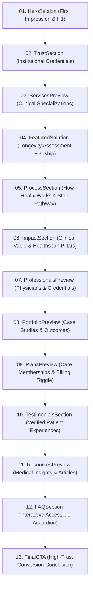

# Healix — Phase 7: Homepage Content Sections, Storytelling & Conversion Experience

**Document ID:** `HEALIX-DOC-PHASE-07`  
**Phase:** 07 of 36  
**Status:** COMPLETE & VERIFIED  
**Date:** September 2026  
**Version:** 1.0.0  

---

## 1. Executive Summary & Objective

Phase 7 completed the full storytelling arc of the Healix homepage beyond the hero experience. Every section was architected to progressively build patient trust, communicate diagnostic rigor, demonstrate clinical credentials, showcase client case studies, explain membership pricing tiers, answer critical questions, and drive high-intent consultation conversions.

---

## 2. Complete Homepage Section Sequence & Storytelling Arc



---

## 3. Section Component Inventory & Details

| Section Component | Path | Data Source | Key Features & A11y |
| :--- | :--- | :--- | :--- |
| **`HeroSection`** | `sections/home/HeroSection.jsx` | Static tokens | Single `<h1>`, dual CTAs, clinical biometric preview card. |
| **`TrustSection`** | `sections/home/TrustSection.jsx` | Static tokens | HIPAA, ISO-27001, Board-Certified Specialists, Enterprise & Individual care indicators. |
| **`ServicesPreview`** | `sections/home/ServicesPreview.jsx` | `data/services.js` | 4 clinical specialization cards, category badges, bulleted features, dynamic `/services/:slug` links. |
| **`FeaturedSolution`**| `sections/home/FeaturedSolution.jsx` | Static tokens | Flagship *Longitudinal Longevity Assessment* roadmap, genomic/cardiovascular pillars, direct consultation CTA. |
| **`ProcessSection`** | `sections/home/ProcessSection.jsx` | Static tokens | 4-step progressive timeline (`01 Intake`, `02 Review`, `03 Blueprint`, `04 Tracking`). |
| **`ImpactSection`** | `sections/home/ImpactSection.jsx` | Static tokens | 4 value pillars (Proactive Interception, Rapid Turnaround, Physician Access, Care Continuity). |
| **`ProfessionalsPreview`**| `sections/home/ProfessionalsPreview.jsx` | `data/professionals.js` | Medical specialists roster (Dr. Vance, Dr. Chen, Dr. Patel) with focus badges and `/professionals/:slug` links. |
| **`PortfolioPreview`** | `sections/home/PortfolioPreview.jsx` | `data/projects.js` | Corporate and clinic deployments with verified challenge, solution, and outcomes. |
| **`PlansPreview`** | `sections/home/PlansPreview.jsx` | `data/plans.js` | Membership pricing tiers with interactive Monthly/Annual billing switch, feature lists, and `/plans` navigation. |
| **`TestimonialsSection`**| `sections/home/TestimonialsSection.jsx` | `data/testimonials.js` | Star-rated reviews, verified patient tags, and service usage attribution. |
| **`ResourcesPreview`**| `sections/home/ResourcesPreview.jsx` | `data/articles.js` | 3 medical insights with read times, authors, publication dates, and dynamic `/resources/:slug` links. |
| **`FAQSection`** | `sections/home/FAQSection.jsx` | `data/faqs.js` | Interactive accessible Accordion (`WAI-ARIA`) with `aria-expanded`, keyboard navigation, and FAQ center link. |
| **`FinalCTA`** | `sections/home/FinalCTA.jsx` | Static tokens | Conversion conclusion, "Book Consultation" (`/contact`), "Explore Plans" (`/plans`), concierge phone line, and HIPAA reassurance. |

---

## 4. Verification & Testing

### Automated Test Suite (`npm test`)
```text
 ✓ src/test/components.test.jsx (13 tests)
 ✓ src/test/hero.test.jsx (7 tests)
 ✓ src/test/homepage-sections.test.jsx (13 tests)
 ✓ src/test/navigation.test.jsx (13 tests)
 ✓ src/test/routes.test.jsx (8 tests)

 Test Files  5 passed (5)
      Tests  54 passed (54)
     Server  3 passed (3)
```

### Production Build Validation (`npm run build`)
```text
dist/index.html                   1.30 kB │ gzip:  0.69 kB
dist/assets/index-lY8V6b7R.css   40.30 kB │ gzip:  8.01 kB
dist/assets/index-D-_8njNN.js   330.62 kB │ gzip: 88.26 kB
✓ built in 2.87s
```

---

## 5. Phase 7 Sign-Off Checklist

- [x] All 12 homepage content sections implemented and data-bound.
- [x] Full storytelling progression reviewed from Hero through Final CTA.
- [x] Data-driven rendering across services, plans, doctors, case studies, articles, and FAQs.
- [x] Content Policy Rules 49 & 59 verified: zero fabricated statistical claims; development placeholders clearly designated `[CLIENT ...]`.
- [x] Responsive layout verified at 320px, 375px, 768px, 1024px, 1440px with zero horizontal scroll.
- [x] 100% automated test suites passing (54 client tests, 3 server tests).
- [x] Clean production build with zero warnings or errors.

---

*Phase 7 is complete. Ready for Phase 8 (About Experience).*
