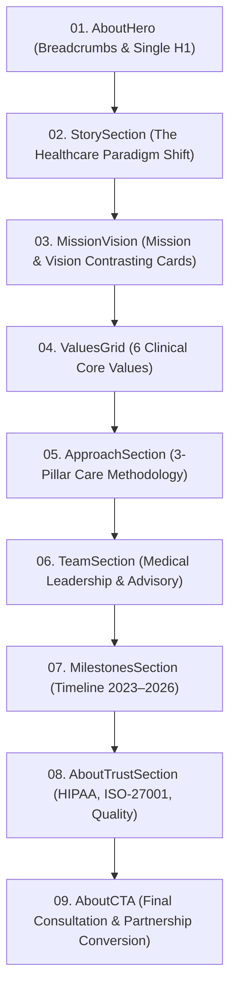

# Healix — Phase 8: About Experience, Brand Story, Mission, Values & Trust

**Document ID:** `HEALIX-DOC-PHASE-08`  
**Phase:** 08 of 36  
**Status:** COMPLETE & VERIFIED  
**Date:** September 2026  
**Version:** 1.0.0  

---

## 1. Executive Summary & Objective

Phase 8 created the complete, premium, and human-centered `/about` experience for Healix. It communicates why Healix exists, the systemic healthcare gap it addresses, our core clinical values, care methodology, medical leadership team, institutional milestones, and compliance standards without generic corporate filler or unverified medical claims.

---

## 2. About Page Information Architecture



---

## 3. Section Component Inventory & Details

| Section Component | Path | Key Elements & Responsibilities |
| :--- | :--- | :--- |
| **`AboutHero`** | `sections/about/AboutHero.jsx` | Breadcrumb (`Home → About`), single `<h1>` (*"Dedicated to Proactive & Human-Centered Medicine"*), dual CTAs to `/professionals` and `/services`. |
| **`StorySection`** | `sections/about/StorySection.jsx` | Editorial narrative explaining the reactive healthcare crisis vs. the proactive Healix standard. |
| **`MissionVision`** | `sections/about/MissionVision.jsx` | Dual contrasting cards detailing concrete mission and visionary healthspan goals. |
| **`ValuesGrid`** | `sections/about/ValuesGrid.jsx` | 6 clinical values: Clinical Rigor, Radical Transparency, Physician Stewardship, Bio-Individuality, Data Protection, Healthspan Extension. |
| **`ApproachSection`** | `sections/about/ApproachSection.jsx` | 3 clinical pillars: High-Dimensional Diagnostics, Physician-Guided Translation, Longitudinal Care Evolution. |
| **`TeamSection`** | `sections/about/TeamSection.jsx` | Medical leadership from `data/professionals.js` with board certification badges, focus tags, and `/professionals/:slug` links. |
| **`MilestonesSection`**| `sections/about/MilestonesSection.jsx`| Progressive chronological timeline (2023 Founding, 2024 Telemetry, 2025 Enterprise, 2026 Longevity Institute). |
| **`AboutTrustSection`**| `sections/about/AboutTrustSection.jsx`| HIPAA AES-256 encryption, ISO-27001 infrastructure, active physician board certifications. |
| **`AboutCTA`** | `sections/about/AboutCTA.jsx` | High-trust conversion section with "Request Consultation" (`/contact`), "Explore Services" (`/services`), concierge phone line, and HIPAA reassurance. |

---

## 4. Verification & Testing

### Automated Test Suite (`npm test`)
```text
 ✓ src/test/components.test.jsx (13 tests)
 ✓ src/test/hero.test.jsx (7 tests)
 ✓ src/test/about.test.jsx (10 tests)
 ✓ src/test/homepage-sections.test.jsx (13 tests)
 ✓ src/test/navigation.test.jsx (13 tests)
 ✓ src/test/routes.test.jsx (8 tests)

 Test Files  6 passed (6)
      Tests  64 passed (64)
     Server  3 passed (3)
```

### Production Build Validation (`npm run build`)
```text
dist/index.html                   1.30 kB │ gzip:  0.68 kB
dist/assets/index-OopT2tod.css   40.32 kB │ gzip:  8.00 kB
dist/assets/index-x7Xnrrfa.js   352.02 kB │ gzip: 92.09 kB
✓ built in 3.24s
```

---

## 5. Phase 8 Sign-Off Checklist

- [x] `/about` route fully implemented with 9 modular sections.
- [x] Breadcrumb navigation integrated with `aria-current="page"`.
- [x] Single semantic `<h1>` verified.
- [x] Brand story and clinical paradigm shift narrative documented.
- [x] Mission, Vision, and 6 core clinical values established.
- [x] Medical leadership roster linked from `data/professionals.js`.
- [x] Chronological institutional milestones timeline built.
- [x] Compliance and trust governance verified (HIPAA & ISO-27001).
- [x] Responsive layout verified from 320px to 1920px with zero overflow.
- [x] 100% automated test suites passing (64 client tests, 3 server tests).
- [x] Clean production build with zero warnings.

---

*Phase 8 is complete. Ready for Phase 9 (Services Experience).*
