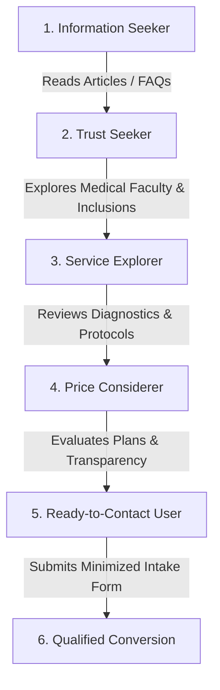

# Healix Healthcare — Advanced Conversion Strategy & Audience Intent Architecture

## 1. Business Purpose & Positioning
Healix is a client-facing brand, trust, and patient-acquisition platform. Its purpose is to communicate high-trust preventative medicine, educate proactive health seekers, showcase board-certified clinicians, and convert qualified visitors into consultation requests without resorting to aggressive sales tactics.

---

## 2. Target Audience Profiles

| Audience Segment | Primary Motivation | Key Questions & Objections | Critical Trust Signal | Recommended CTA Path |
| :--- | :--- | :--- | :--- | :--- |
| **Proactive Longevity Seekers** | Early biomarker detection, healthspan extension, preventive cardiology. | "Is this evidence-based or wellness hype?" | Board-certified faculty bios, clinical research references. | `Explore Care Plans` $\rightarrow$ `/plans` |
| **Executive Wellness Clients** | Comprehensive annual diagnostic evaluation, minimal time friction. | "How fast can I get tested and reviewed?" | Same-week availability badge, structured 60–90 min protocol breakdown. | `Schedule Consultation` $\rightarrow$ `/contact` |
| **Diagnostic & Symptom Inquirers** | Seeking specialist second opinions on metabolic or endocrine concerns. | "Will I speak directly with a physician?" | Physician-led intake notice, multidisciplinary peer review badge. | `Meet Medical Faculty` $\rightarrow$ `/professionals` |

---

## 3. User Intent Modeling & Journey Mapping

---

## 4. CTA Hierarchy & Intent Alignment

1. **Primary Action**: `"Schedule Consultation"` / `"Request Consultation"`
   - Used in sticky header action slot, hero primary button, and service detail booking cards.
   - Points directly to `/contact` with optional service query pre-selection.
2. **Secondary Action**: `"Explore Care Plans"` / `"View Membership Tiers"`
   - Used as hero secondary button and mid-page transitional links.
   - Points to `/plans` for transparent cost exploration.
3. **Supporting Action**: `"Meet Medical Faculty"` / `"Read Clinical Guide"`
   - Low-friction informational exploration guiding visitors deeper into trust assets.

---

## 5. Objection Mapping & Trust Defenses

| Common Objection | Root Cause | Website Mitigation Strategy |
| :--- | :--- | :--- |
| **"Healthcare pricing is unpredictable."** | Hidden fee anxiety in traditional clinical systems. | Full price transparency on `/plans`, 15% annual savings highlight, and explicit HSA/FSA eligibility badges. |
| **"Is my health information private?"** | Spam and data breach fears. | Prominent HIPAA privacy notices on forms, zero-PHI analytics, and explicit data-minimization commitments. |
| **"Are the doctors qualified?"** | Unverified telemedicine claims online. | 100% board-certified clinician profiles with documented specialties, subspecialties, and clinical leadership roles. |
