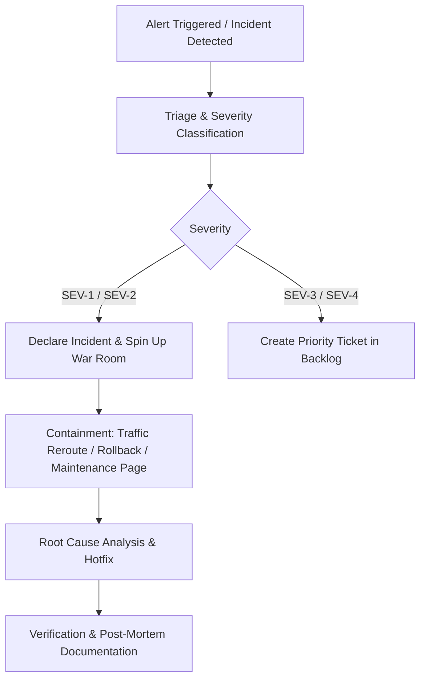

# Healix Healthcare Platform — Incident Response Plan

## 1. Severity Levels & SLA Targets

| Severity | Definition | Target Response (MTTD) | Target Resolution (MTTR) | Notification Scope |
| :--- | :--- | :--- | :--- | :--- |
| **SEV-1 (Critical)** | Complete platform outage, data breach, or security incident affecting patient data. | < 5 minutes | < 30 minutes | Executive team, Clinical Ops, Engineering On-Call |
| **SEV-2 (High)** | Key conversion path broken (e.g. `/contact` or `/plans` booking failure), API rate limiting malfunction. | < 15 minutes | < 2 hours | Engineering On-Call, Support Lead |
| **SEV-3 (Medium)** | Non-blocking UI glitch, minor layout defect on specific device, localized asset loading delay. | < 1 hour | < 8 hours | Engineering Team |
| **SEV-4 (Low)** | Minor copy typo, minor enhancement request, non-functional documentation tweak. | < 1 business day | Next sprint release | Engineering Team |

---

## 2. Incident Response Workflow

### Immediate Containment Actions
1. **Rollback Deployment**:
   - Vercel/Netlify: Instant roll-back to previous stable deployment SHA in dashboard or CLI (`vercel rollback`).
   - Docker/VPS: Re-tag previous container image (`docker run -d healix-platform:v0.9.9`) or re-symlink Nginx web root.
2. **Maintenance Mode Activation**: Serve static fallback `/maintenance.html` (503 Service Unavailable) with clinical phone contact options.
3. **Communication**: Update status page (`status.healix.health`) every 15 minutes during active SEV-1 incidents.
