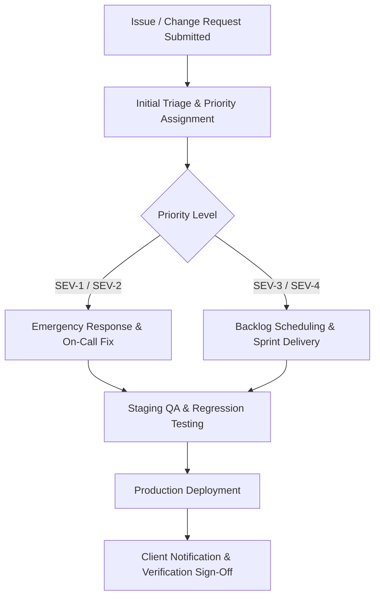

# Healix Healthcare Platform — Technical Support & Change Request Process

## 1. Support Request Lifecycle

---

## 2. Request Classification & SLA

- **Bug / Defect**: Unintended deviation from documented requirements. (SLA: Critical < 2h, Major < 8h, Minor Next Sprint).
- **Content Update**: Text, pricing, or clinician changes. (SLA: 2–3 business days).
- **Design Enhancement**: Layout, color, or component additions. (SLA: Scoped via sprint backlog).
- **Security / Compliance Patch**: Vulnerability remediation. (SLA: Critical < 24h).
