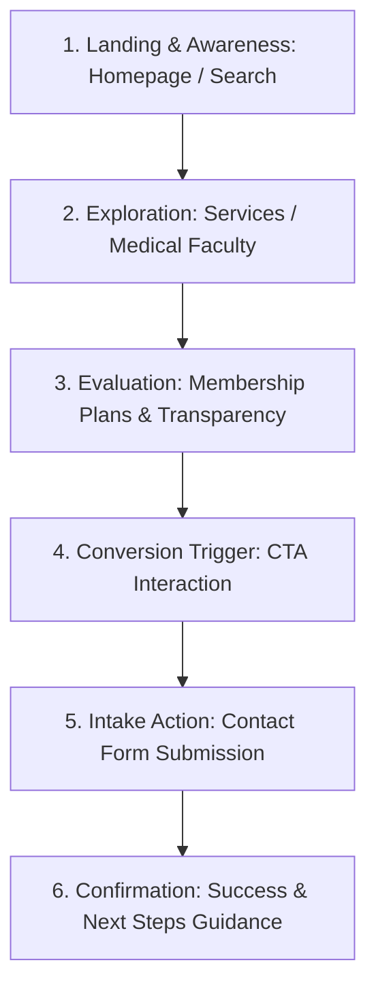

# Healix Healthcare — Conversion Funnel & User Journey Analysis

## 1. Primary Conversion Funnel Architecture

---

## 2. Funnel Stage Objectives & Optimization Levers

### Stage 1: Landing & Brand Trust (Homepage Hero & Features)
- **Objective**: Establish clinical credibility, communicate human-centered preventative care, and engage visitor within 5 seconds.
- **Key Levers**: Dynamic typography contrast, board-certified trust badges, frictionless primary CTA ("Schedule Consultation").

### Stage 2: Specialization Discovery (Services & Professionals)
- **Objective**: Help patients quickly discover relevant clinical programs (e.g. cardiovascular screening, endocrine health, longevity medicine).
- **Key Levers**: Interactive category filters, clear duration/availability badges, direct clinician bios.

### Stage 3: Transparency & Plan Evaluation (Plans Page)
- **Objective**: Eliminate billing anxiety with transparent fee structures and comprehensive inclusions.
- **Key Levers**: Monthly/Annual pricing switch with 15% discount indicator, side-by-side feature comparison matrix.

### Stage 4: Intake & Consultation Request (Contact Form)
- **Objective**: Maximize form completion rate while maintaining strict data minimization.
- **Key Levers**: 5 essential fields only, inline real-time validation, prominent HIPAA privacy disclaimer, accessible error alerts.
