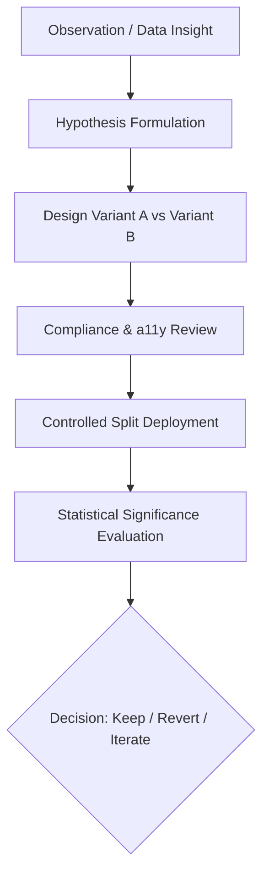

# Healix Healthcare — Ethical A/B Testing & Experimentation Framework

## 1. Experimentation Principles in Healthcare
Healthcare digital experiences require elevated ethical responsibility:
- **Zero Deceptive Patterns**: Never utilize artificial countdown timers, false scarcity notices ("Only 2 memberships left!"), or misleading pricing representations.
- **Strict Privacy & Safety**: Experiments must never alter safety disclosures, medical disclaimers, or privacy protections.
- **Accessibility Invariance**: Variant UI components must strictly maintain WCAG 2.1 AA compliance (contrast, keyboard navigation, screen reader labels).

---

## 2. A/B Experiment Lifecycle

---

## 3. Prioritized Experiment Backlog

### Experiment EXP-01: Hero Primary CTA Copy
- **Hypothesis**: Changing primary CTA button text from `"Schedule Consultation"` to `"Explore Care Plans"` may increase initial click-through for visitors in the early exploration phase.
- **Target Audience**: 50/50 split on new desktop visitors to `/`.
- **Primary Metric**: Click-through rate to `/contact` or `/plans` without reducing completed consultation inquiries.
- **Duration**: 21 days or 1,000 conversions.
- **Decision Rule**: Adopt variant only if total end-funnel inquiries remain equal or higher with $p < 0.05$.

### Experiment EXP-02: Plans Page Billing Switch Highlight
- **Hypothesis**: Adding a subtle glowing pill badge `"Most Popular — Save 15%"` on the annual billing switch will increase annual plan selections.
- **Target Audience**: All visitors to `/plans`.
- **Primary Metric**: Percentage of consultation requests specifying Annual membership.
- **Duration**: 30 days.
