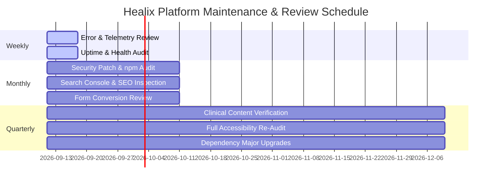

# Healix Healthcare — Long-Term Maintenance & Review Cycle

## 1. Recurring Operational Cadence

---

## 2. Review Responsibilities

| Cadence | Focus Area | Responsible Role | Key Deliverables |
| :--- | :--- | :--- | :--- |
| **Weekly** | Errors, Latencies, Uptime | DevOps / On-Call Engineer | Sentry error triage, health check uptime report |
| **Monthly** | Security & Minor Updates | Lead Frontend Engineer | `npm audit` patch report, Core Web Vitals RUM audit |
| **Quarterly**| Clinical & Compliance Review | Clinical Ops & Lead Engineer | Physician credential verification, WCAG 2.1 AA audit |
| **Annual** | Architecture & Roadmap | CTO & Executive Stakeholders | Tech stack evaluation, strategic platform review |
