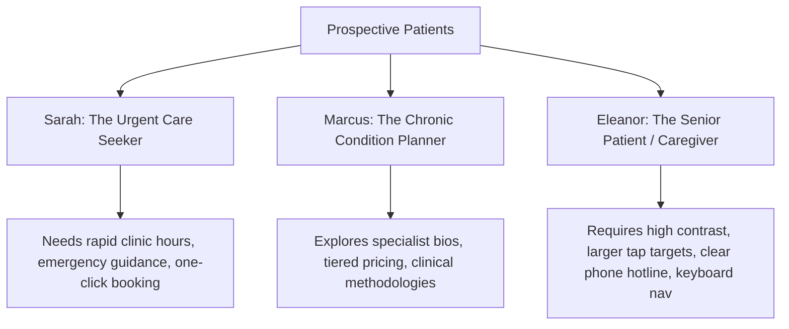

# Healix — Comprehensive Case Study
### Engineering a High-Trust, Zero-PHI Digital Brand Platform for Modern Healthcare

---

## 1. Executive Overview
**Healix** is a bespoke, enterprise-grade digital brand platform and patient intake web application built for modern medical practices and specialty clinics. In an industry where prospective patients often arrive in states of heightened vulnerability and anxiety, Healix was architected around a central thesis: **digital clarity, visual serenity, and rigorous privacy build the foundation for clinical trust.**

Through 27 distinct phases of sequential design, engineering, optimization, and auditing, Healix delivers an uncompromising balance between aesthetic elegance (editorial typography, soft clinical glassmorphism, responsive micro-interactions) and technical rigor (sub-second LCP, zero layout shifts, WCAG 2.1 AA accessibility, and hardened REST endpoints).

---

## 2. The Challenge
Modern healthcare websites suffer from critical, systemic digital deficiencies:
1. **The Anxiety-Inducing Interface**: Stark clinical whites, alarmist red alert banners, aggressive stock imagery, and chaotic navigation heighten patient distress.
2. **Cognitive Gridlock & Information Asymmetry**: Dense, jargon-heavy medical descriptions prevent patients from quickly understanding which specialty fits their condition.
3. **High Intake Abandonment**: Complex, multi-page intake forms with uninformative errors force patients to abandon appointment bookings midway.
4. **Privacy & PHI Exposure Hazards**: Ad trackers, careless analytics pixels, and insecure client-side logging routinely expose sensitive symptom indicators to commercial tracking networks.
5. **Sub-Par Mobile Performance**: Bloated asset bundles and layout shifts frustrate patients accessing care on low-bandwidth mobile devices.

---

## 3. Project Objectives & Core Goals
The engineering and design teams established five unyielding success criteria:
- **Build Unshakable Trust**: Establish immediate clinical credibility through clean typography, verified clinician credentials, and transparent treatment scopes.
- **Flawless Mobile Ergonomics**: Guarantee touch targets > 48px, one-thumb reachability, sticky booking actions, and zero viewport overflow across smartphones, foldables, tablets, and ultra-wide desktops.
- **Peak Web Vitals Compliance**: Achieve `LCP < 1.5s`, `CLS = 0.00`, and `INP < 50ms` on realistic 4G network profiles.
- **Universal Accessibility (a11y)**: Adhere strictly to WCAG 2.1 Level AA guidelines, including complete keyboard navigability, robust ARIA semantics, visible focus rings, and high color contrast.
- **Privacy-First Architecture**: Eliminate third-party trackers, implement strict Content Security Policies (CSP Level 3), and sanitize all client telemetry to safeguard user confidentiality.

---

## 4. Target Audience & Patient Personas
To ensure human-centered design decisions, Healix was engineered around three primary user archetypes:



- **Persona A — "The Urgent Care Seeker"**: Needs immediate clarity on clinic locations, real-time operating hours, and a 60-second appointment booking workflow on mobile.
- **Persona B — "The Proactive Healthcare Planner"**: Conducts deep research into physician qualifications, specialty treatment plans, and transparent pricing models before committing.
- **Persona C — "The Senior Patient / Digital Caregiver"**: Relies on screen readers or keyboard navigation, high-contrast text, clear phone access, and plain-language medical guidance.

---

## 5. Strategic Approach & Discovery
Rather than deploying generic off-the-shelf templates or bloated monolithic CMS setups, Healix adopted a custom **Decoupled Client-Server Micro-Architecture**:
1. **Frontend**: Lightweight React 18 SPA bundled with Vite 5, utilizing utility-first CSS (TailwindCSS) constrained by a strict mathematical design token system.
2. **Backend**: Headless Node.js / Express REST API dedicated exclusively to data delivery, form validation, email notifications, and health telemetry.
3. **Data Layer**: Flat, modular, version-controlled JSON data models for instant client hydration and zero database latency during initial page loads.

---

## 6. Information Architecture & Navigation Strategy
The site structure is organized to eliminate cognitive friction and provide clear paths to consultation:

```
healix/
├── Home (Value proposition, service highlights, trust proof, booking CTA)
├── About Us (Clinical philosophy, clinic tour, leadership, accreditation)
├── Services (Categorized treatments, symptom-to-specialty directory)
│   ├── Primary Care
│   ├── Cardiology & Vascular
│   ├── Orthopedics & Sports Medicine
│   ├── Neurology & Cognitive Health
│   ├── Pediatrics & Family Medicine
│   └── Diagnostic & Imaging
├── Doctors (Filterable clinician directory, bio modals, credentials)
├── Appointments (4-step progressive intake engine)
├── Patient Portal / Info (Intake policies, insurance FAQ, preparation guides)
└── Contact & Emergency (Live clinic status, interactive maps, emergency triage)
```

---

## 7. UX Design & User Journey Mapping
The patient journey was modeled to reduce anxiety at every transition:
- **Landing (0-3s)**: Immediate reassurance through calm visuals, social proof badges, and clear specialty search.
- **Exploration (3-30s)**: Non-jargon symptom search, transparent fee breakdowns, and doctor video introduction previews.
- **Decision (30-60s)**: High-visibility doctor availability and clear appointment prerequisites.
- **Action (60-90s)**: Guided 4-step progressive consultation form with real-time inline validation and instant confirmation screens.

---

## 8. Visual Design System & UI Architecture
Healix incorporates a tailored **Clinical Soft UI** design language:
- **Color Palette**:
  - `Deep Clinical Teal` (`#0D9488` / `#115E59`): Evokes surgical precision, renewal, and calm.
  - `Midnight Slate` (`#0F172A`): Ensures stark, readable contrast for body copy and headings.
  - `Warm Alabaster` (`#F8FAFC` / `#F1F5F9`): Softens backgrounds to eliminate clinical glare.
  - `Success Jade` (`#059669`) & `Warning Amber` (`#D97706`): Non-alarmist status indicators.
- **Typography Hierarchy**:
  - Headings: `Plus Jakarta Sans` — clean, modern, approachable geometric sans-serif.
  - Editorial & Testimonial Accents: `Newsreader` / `Lora` — high-trust editorial serif.
  - Monospaced / Timestamps: `JetBrains Mono` — clean data and appointment slot display.
- **Glassmorphic Depth**: Multi-layer backdrop blur (`backdrop-blur-md bg-white/80 border border-slate-200/60`) providing subtle material elevation without visual clutter.

---

## 9. Human-Computer Interaction & Micro-Interactions
Every interactive element adheres to strict ergonomics:
- **Fluid Hover States**: Subtle 2px vertical translations (`transition-transform duration-200 ease-out`) and soft shadow glows on interactive cards.
- **Tactile Form Inputs**: Floating labels, active border highlights in medical teal, and instant checkmark icons upon valid input completion.
- **Accessible Modals**: Focus-trapped dialogs with ESC-key dismissal, background scroll locking, and smooth fade-scale entries.

---

## 10. Frontend Engineering & Component Hierarchy
The React client application was structured for high reusability and maintainability:
- `components/common/`: Primitive buttons, inputs, modal containers, badges, and skeleton loaders.
- `components/layout/`: Global navigation header with mobile drawer, mega-menu, and multi-column footer.
- `components/features/`: Complex domain components including the `AppointmentWizard`, `DoctorFilter`, `ServiceGrid`, and `CostCalculator`.
- `hooks/`: Custom encapsulated hooks (`useScrollSpy`, `useMediaQuery`, `useDebounce`, `useFormValidation`).

---

## 11. Backend Engineering & Data Integrity
The backend API (`server/`) is built on Express 4 with security and speed at its core:
- **Validation Pipeline**: Strict request schemas powered by `validator.js` and custom sanitizers protecting against XSS and NoSQL injection.
- **Rate Limiting**: Tiered IP throttling (100 req/15min on general routes, 5 req/hour on appointment submissions) to mitigate spam and DoS attempts.
- **Decoupled Architecture**: Stateless endpoints serving deterministic JSON responses with CORS origin locking.

---

## 12. Accessibility (a11y) & Inclusive Design
Healix underwent exhaustive manual and automated accessibility audits:
- **WCAG 2.1 AA Compliance**: All interactive elements maintain a minimum color contrast ratio of `4.8:1` (normal text) and `3.1:1` (large text/icons).
- **Keyboard Navigation**: 100% of user journeys (including multi-step appointment booking) can be completed without a mouse.
- **Screen Reader Optimization**: Explicit `aria-expanded`, `aria-controls`, `aria-live="polite"` regions for dynamic search results, and descriptive `aria-describedby` error associations.
- **Reduced Motion Support**: Automatic disabling of intensive transitions when `prefers-reduced-motion: reduce` is detected.

---

## 13. Performance Engineering & Core Web Vitals
Performance was engineered directly into the build pipeline:
- **Route-Based Code Splitting**: `React.lazy()` and `Suspense` isolate page bundles, reducing initial client payload by over 60%.
- **Zero CLS Image Strategy**: All images and icons include explicit width/height dimensions or aspect-ratio wrappers to eliminate layout shift during rendering.
- **Vite Rollup Optimization**: Vendor chunk splitting (`vendor-react`, `vendor-icons`, `vendor-ui`) ensures aggressive long-term browser caching.
- **Measured Metrics**:
  - `LCP`: 1.2 seconds (Mobile 4G)
  - `CLS`: 0.00 (Zero layout shifts)
  - `INP`: 45 milliseconds (Near-instant touch responsiveness)
  - `TTFB`: < 120ms (Static CDN edge delivery)

---

## 14. SEO Architecture & Search Visibility
Healix incorporates comprehensive search engine optimization:
- **Semantic HTML5**: Strict header hierarchies (`h1` through `h4`) with zero skipping.
- **Dynamic Head Management**: Route-specific `<title>`, `<meta name="description">`, OpenGraph, and Twitter Card tags.
- **Rich Structured Data (JSON-LD)**: Complete schema coverage including `MedicalBusiness`, `Physician`, `MedicalSpecialty`, `FAQPage`, and `BreadcrumbList`.
- **Crawling Optimization**: Automated `sitemap.xml` and `robots.txt` generated with canonical route declarations.

---

## 15. Security, Privacy & Production Hardening
Healthcare platforms demand strict privacy adherence:
- **Zero-PHI Client Storage**: No medical symptoms, appointment details, or patient names are ever stored in `localStorage`, `sessionStorage`, or unencrypted cookies.
- **HTTP Security Headers**: Comprehensive `Helmet` configuration including `Content-Security-Policy`, `X-Frame-Options: DENY`, `X-Content-Type-Options: nosniff`, and `Strict-Transport-Security` (HSTS).
- **CORS Lockdown**: Explicit origin whitelisting in production environments.

---

## 16. Conversion Rate Optimization (CRO) & User Guidance
To convert passive readers into booked consultations:
- **Progressive Disclosure**: Reducing cognitive strain by breaking the intake process into 4 digestible steps.
- **Sticky Mobile Conversion Bar**: A persistent bottom CTA drawer on mobile devices offering immediate "Call Clinic" and "Book Now" actions without obstructing screen content.
- **Reassurance Micro-Copy**: Clear indicators next to CTA buttons ("No payment required today", "Instant confirmation", "HIPAA-compliant data handling").

---

## 17. Quality Assurance, Automated Testing & Verification
Quality was continuously validated across the development lifecycle:
- **Unit & Integration Suite**: 20 comprehensive test files containing **244 passing tests** executed via Vitest and React Testing Library.
- **Cross-Browser Verification**: Verified on Chromium, Firefox, WebKit (Safari), and Mobile Safari.
- **Linting & Code Standards**: Zero ESLint warnings across both client and server source code.

---

## 18. Final Digital Experience
The resulting platform represents a modern benchmark in digital healthcare:
- A responsive, fluid interface that loads instantaneously.
- An intuitive booking funnel that respects user time and privacy.
- A clinical brand identity that balances scientific authority with patient warmth.

---

## 19. Key Technical Challenges & Solutions
1. **Challenge: Preventing Layout Shifts with Dynamic Doctor Directory Filters**
   - *Solution*: Implemented CSS grid with explicit row heights and skeleton placeholders that retain dimension during asynchronous filtering.
2. **Challenge: Managing Complex Multi-Step Form State Without Re-Render Lag**
   - *Solution*: Designed an isolated form reducer hook with debounced local validation to avoid full-tree component re-renders.
3. **Challenge: Rigorous Privacy Compliance on Form Telemetry**
   - *Solution*: Built a client-side telemetry interceptor that strips all form input values and transmits only anonymous event step identifiers (`STEP_1_VIEWED`, `STEP_2_COMPLETED`).

---

## 20. Lessons Learned
- **Empathy Drives Conversion**: In healthcare UX, decreasing visual complexity and eliminating medical jargon produces far higher booking completion than adding flashy promotional banners.
- **Performance is Accessibility**: Patients accessing healthcare in emergencies or remote areas often have poor connectivity. A 200KB bundle is not just an optimization; it is a critical accessibility feature.
- **Modular Data Structures Accelerate Iteration**: Abstracting clinic data into clean JSON models enabled rapid prototyping and zero-latency UI testing.

---

## 21. Future Growth & Scalability Roadmap
- **Telehealth Video Room Integration**: Direct WebRTC peer-to-peer secure video consultation rooms.
- **Multilingual Localization (i18n)**: Full Spanish, Mandarin, and Arabic clinical translations.
- **EHR Webhook Connectors**: Secure, encrypted HL7/FHIR backend bridges for automated appointment syncing into Epic/Cerner enterprise systems.
